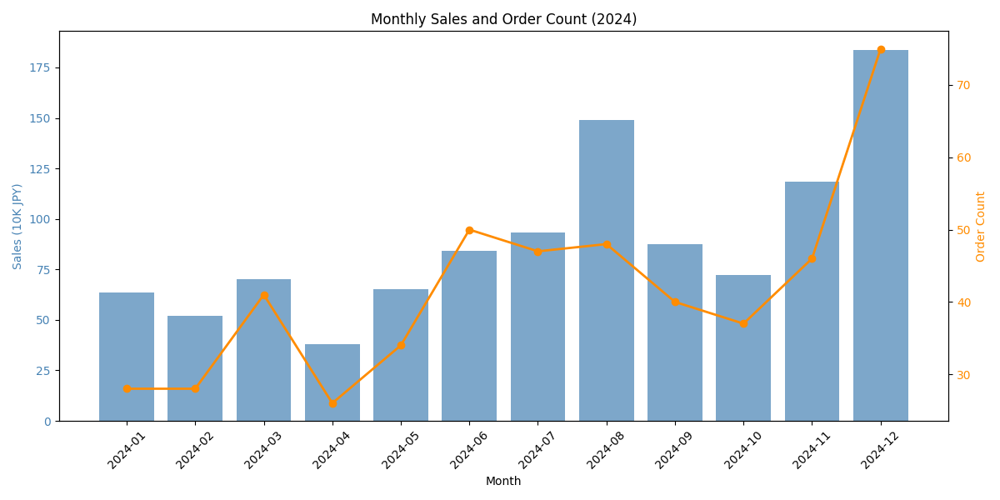
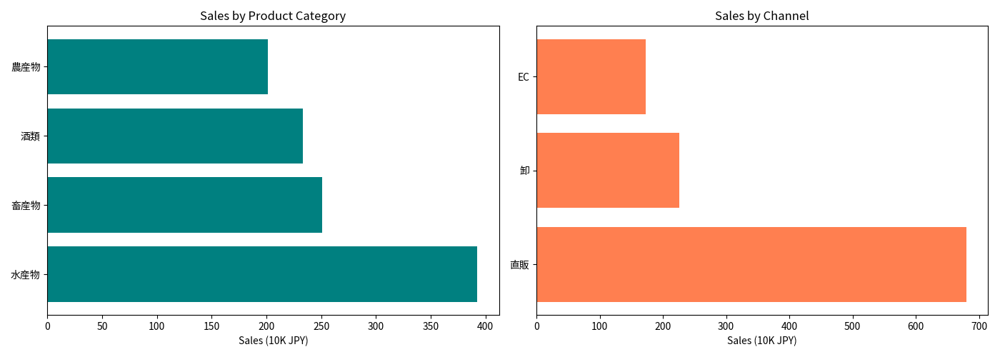
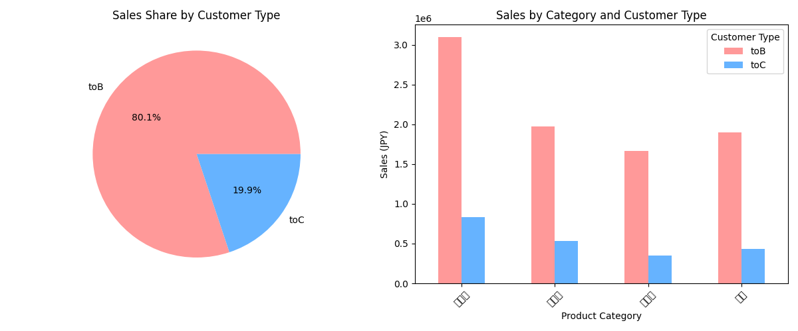
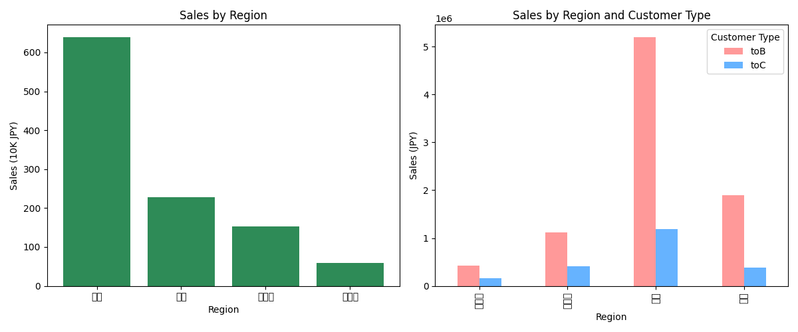
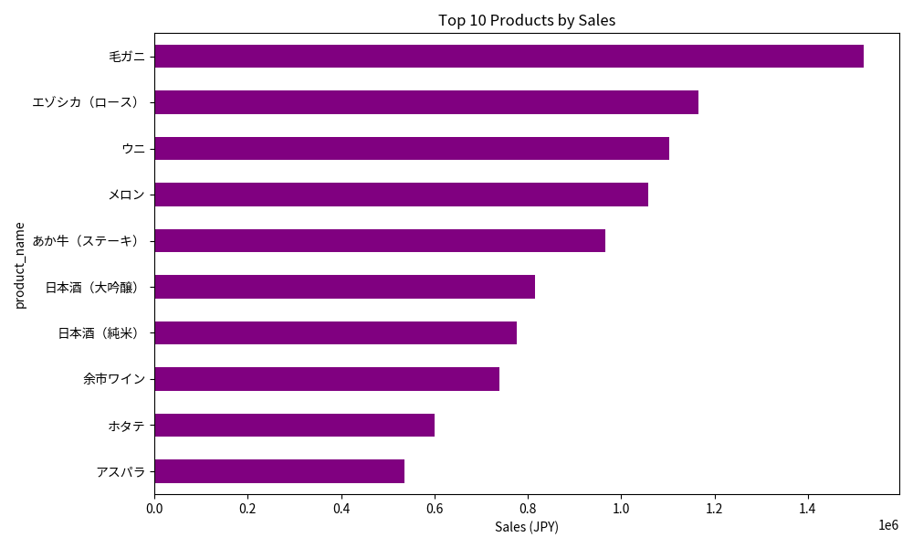

# 北海道食材販売データ EDA レポート

## 概要

- **分析対象期間**: 2024年1月〜12月
- **総レコード数**: 500件
- **総売上**: 10,781,200円
- **平均注文単価**: 21,562円
- **ユニーク顧客数**: 91人

---

## 1. 基本統計量

| 指標 | 数量 | 単価（円） | 売上金額（円） |
|------|------|-----------|---------------|
| 平均 | 5.8 | 3,773 | 21,562 |
| 標準偏差 | 7.1 | 2,045 | 31,950 |
| 最小 | 1 | 800 | 800 |
| 25% | 2 | 2,000 | 4,500 |
| 中央値 | 3 | 3,500 | 10,000 |
| 75% | 5 | 5,500 | 22,500 |
| 最大 | 30 | 8,000 | 240,000 |

---

## 2. データ品質

### 欠損値
| カラム | 欠損数 | 欠損率 |
|--------|--------|--------|
| is_repeat | 56 | 11.2% |
| その他 | 0 | 0% |

**所見**: `is_repeat`（リピート購入フラグ）に約11%の欠損があり、リピート分析時は注意が必要。

---

## 3. 月別売上推移

| 月 | 売上金額（円） | 注文数 |
|----|--------------|--------|
| 1月 | 637,700 | 28 |
| 2月 | 520,000 | 28 |
| 3月 | 701,300 | 41 |
| 4月 | 381,100 | 26 |
| 5月 | 654,100 | 34 |
| 6月 | 842,100 | 50 |
| 7月 | 932,500 | 47 |
| 8月 | 1,491,600 | 48 |
| 9月 | 875,800 | 40 |
| 10月 | 722,000 | 37 |
| 11月 | 1,185,100 | 46 |
| 12月 | 1,837,900 | 75 |

### 季節性の傾向
- **12月が最大**: 年末需要（ギフト・おせち向け）で売上最高（約184万円）
- **8月**: 夏季ギフト（お中元）需要で高売上
- **11月**: 年末に向けた仕入れ増加
- **4月が最低**: 年度切替で法人需要が落ち込む傾向

---

## 4. 商品カテゴリ別分析

| カテゴリ | 売上（円） | 構成比 | 注文数 | 平均単価 |
|---------|-----------|--------|--------|----------|
| 水産物 | 3,927,000 | 36.4% | 164 | 23,945 |
| 畜産物 | 2,508,000 | 23.3% | 82 | 30,585 |
| 酒類 | 2,330,500 | 21.6% | 105 | 22,195 |
| 農産物 | 2,015,700 | 18.7% | 149 | 13,528 |

### 所見
- **水産物**が売上の約36%を占め主力商品
- **畜産物**は注文数は少ないが平均単価が最も高い（約3万円）
- **農産物**は注文数は多いが単価が低い

---

## 5. チャネル別分析

| チャネル | 売上（円） | 構成比 | 注文数 | 平均単価 |
|---------|-----------|--------|--------|----------|
| 直販 | 6,801,500 | 63.1% | 203 | 33,505 |
| 卸 | 2,256,300 | 20.9% | 70 | 32,233 |
| EC | 1,723,400 | 16.0% | 227 | 7,592 |

### 所見
- **直販**が売上の約63%で主力チャネル
- **EC**は注文数最多だが単価が低い（約7,600円）→ 個人向け小口注文中心
- **卸**は高単価だがボリュームは少ない

---

## 6. 顧客種別（toB/toC）比較

| 顧客種別 | 売上（円） | 構成比 | 注文数 | 平均単価 | 平均数量 |
|---------|-----------|--------|--------|----------|----------|
| toB（法人） | 8,636,400 | 80.1% | 219 | 39,436 | 11個 |
| toC（個人） | 2,144,800 | 19.9% | 281 | 7,633 | 2個 |

### 所見
- **toB（法人）が売上の80%を占める**
- toB平均単価はtoCの約5倍
- toC注文数は多いが小口購入が中心
- **リピート率**: toB 58.0% / toC 58.6%（ほぼ同等）

---

## 7. 地域別分析

| 地域 | 売上（円） | 構成比 | 注文数 |
|------|-----------|--------|--------|
| 関東 | 6,390,900 | 59.3% | 285 |
| 関西 | 2,280,700 | 21.2% | 92 |
| 北海道 | 1,527,500 | 14.2% | 82 |
| その他 | 582,100 | 5.4% | 41 |

### 所見
- **関東が売上の約60%** → 首都圏の飲食・ホテル需要が大きい
- 地元の北海道は売上比率は低め（物流コスト・競合影響か）

---

## 8. 商品別売上TOP10

| 順位 | 商品名 | 売上（円） |
|------|--------|-----------|
| 1 | 毛ガニ | 1,520,000 |
| 2 | エゾシカ（ロース） | 1,166,000 |
| 3 | ウニ | 1,104,000 |
| 4 | メロン | 1,057,500 |
| 5 | あか牛（ステーキ） | 966,000 |
| 6 | 日本酒（大吟醸） | 815,000 |
| 7 | 日本酒（純米） | 777,000 |
| 8 | 余市ワイン | 738,500 |
| 9 | ホタテ | 600,000 |
| 10 | アスパラ | 535,000 |

### 所見
- **毛ガニが最高売上**（年末需要が大きい）
- 水産物・畜産物の高単価商品が上位
- 酒類も安定した売上

---

## 9. 相関分析

| | 数量 | 単価 | 売上 |
|--|------|------|------|
| 数量 | 1.000 | -0.014 | 0.828 |
| 単価 | -0.014 | 1.000 | 0.351 |
| 売上 | 0.828 | 0.351 | 1.000 |

### 所見
- **売上は数量との相関が強い**（r=0.83）
- 単価と数量はほぼ無相関 → 大量購入で単価が下がるわけではない

---

## 10. 主な発見・提言

### ビジネスインサイト

1. **年末需要の最大化**
   - 12月の売上が突出（全体の17%）
   - 毛ガニ・ウニ等の水産物が牽引
   - →早期予約キャンペーン等で機会損失を防ぐ

2. **toB顧客の重要性**
   - 売上の80%がtoB
   - ホテル・レストラン向け営業強化が効果的

3. **ECチャネルの課題**
   - 注文数は最多だが単価が低い
   - →セット商品・まとめ買い割引でLTV向上を検討

4. **北海道地元売上の伸びしろ**
   - 地元売上比率14%は低い
   - 地産地消キャンペーンの余地あり

5. **畜産物の高単価戦略**
   - 平均単価3万円超で高収益
   - エゾシカ・あか牛のプレミアム訴求を強化

---

## 出力ファイル一覧

| ファイル名 | 内容 |
|-----------|------|
| 01_monthly_sales.png | 月別売上・注文数推移 |
| 02_category_channel_sales.png | カテゴリ別・チャネル別売上 |
| 03_customer_type_analysis.png | 顧客種別分析 |
| 04_region_analysis.png | 地域別分析 |
| 05_product_top10.png | 商品別売上TOP10 |
| 06_monthly_category_heatmap.png | 月別×カテゴリ売上ヒートマップ |

---

*分析実施日: 2024年*
